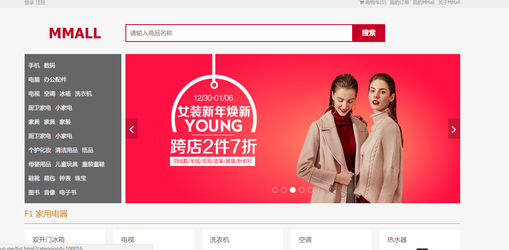
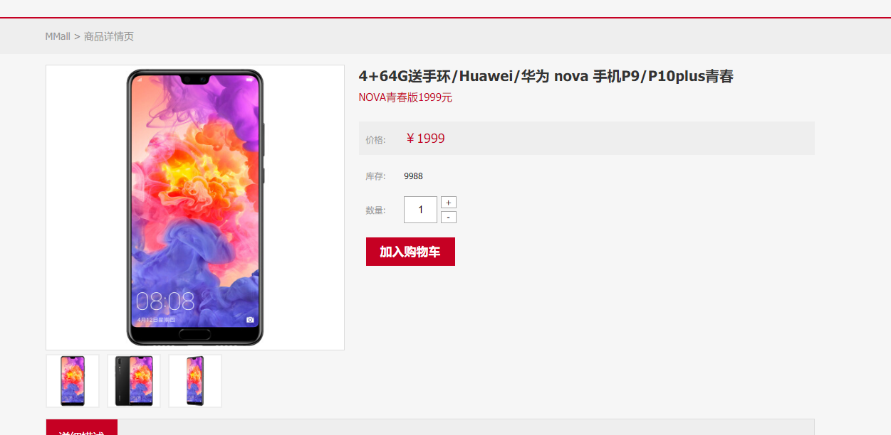
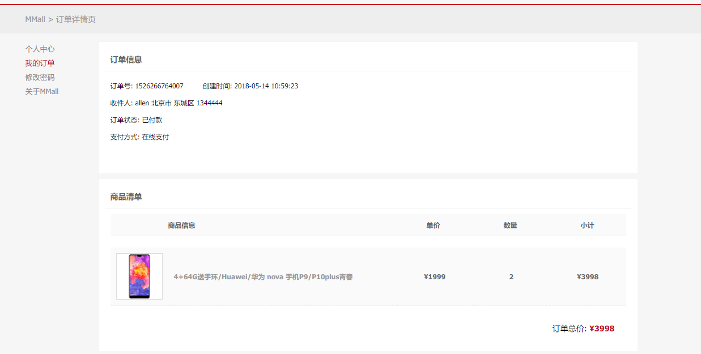
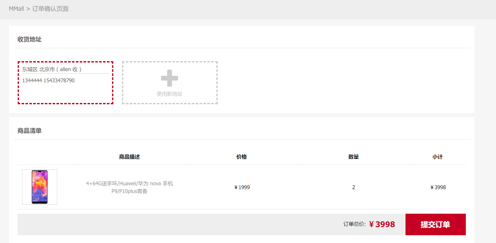
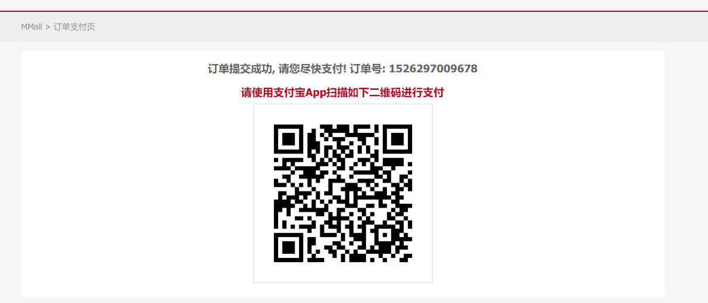

## Tmmall前端项目
### 项目简介

> 采用`Jquery+CommonJS`进行模块化开发的前端项目，通过Ajax与后台交互，拿到数据，利用[hogan.js](https://github.com/twitter/hogan.js)模板引擎渲染数据到Html页面, 通过CommonJS分别建立了用户模块、订单模块、购物车模块、商品详情模块、以及支付模块，并且通过前端webpack打包工具对 不同模块的**Javascript**,  **html**,  **css**的模块文件打包成整体，压缩上线。Tmmall的后台项目[戳这里](https://github.com/Allenskoo856/TmallBackEnd)

---

### 项目线上Demo

http://mmall.zonglun.me

### 项目预览截图











---

### 详细的后台接口文档

https://github.com/Allenskoo856/TmallFontEnd/wiki

### 本地预览

- 确保本机安装了git，node（Version>6.0), npm

  ```shell
  git clone https://github.com/Allenskoo856/TmallFontEnd.git
  ```

- ```shell
  cd /TmallFontEnd
  npm install
  ```

- 本地预览

  ```shell
  npm run dev
  ```

  访问http://localhost:8088/dist/view/index.html

- 打包部署

  ```shell
  npm run dist
  ```

### TODo

- [ ] 美化界面


- [ ] 利用Vue框架重构项目